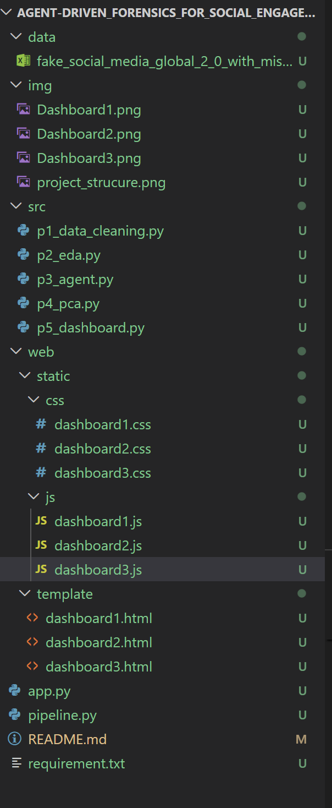
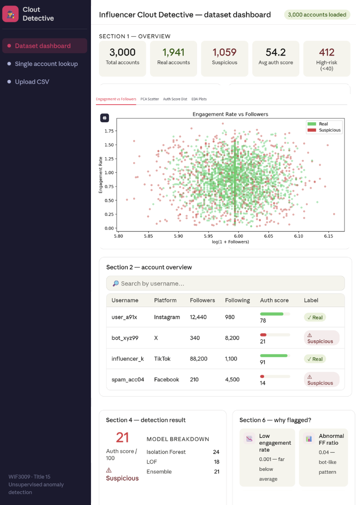
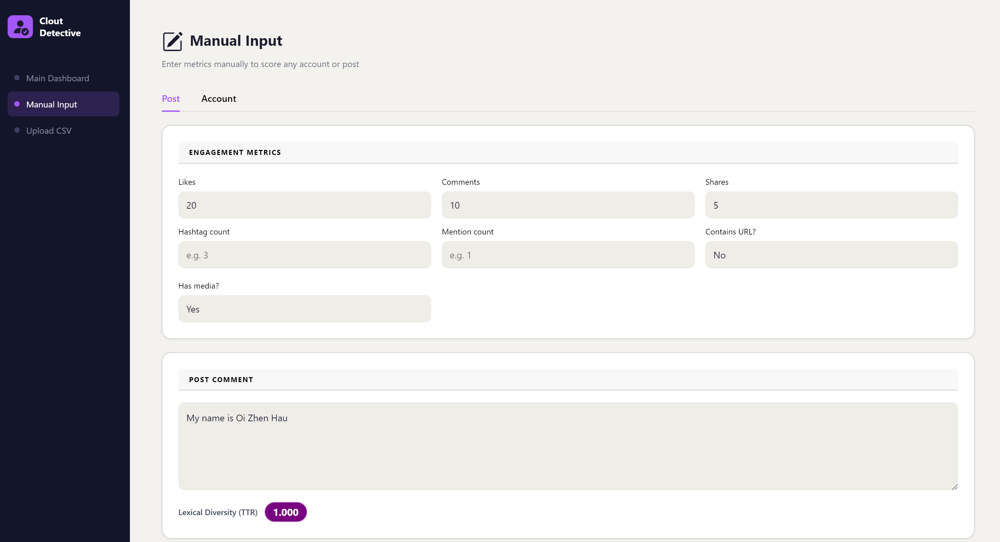
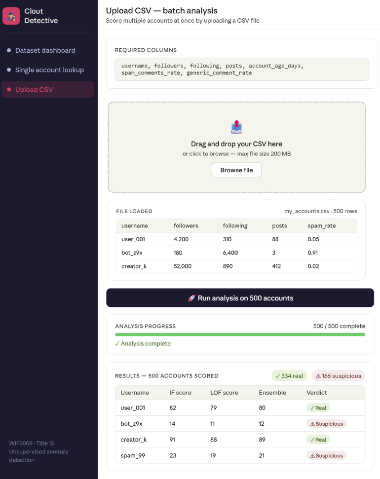

# Influencer Clout Detective: Agent-Driven Forensics for Social Engagement

## Important Notes:
> The ongoing work is on the `dev` branch, please commit your work there instead of `main` branch
> Please clone it the link `https://github.com/OIZHENHAU/Agent-Driven_Forensics_for_Social_Engagement.git` in VSCode as well, yeah.

## Project Overview

- `Background`: In influencer marketing, engagement manipulation invalidates advertising spend. Detecting bot activity requires analyzing statistical distributions of organic human behavior.
- `Overview`: A forensic statistics project utilizing unsupervised machine learning to detect multivariate outliers, managed by an investigative AI agent.
- `Objective`: Identify fraudulent accounts entirely without labeled data. The agent will utilize outlier detection tools to assume artificially inflated metrics deviate from the log-normal distribution of organic engagement.
- `Dataset`: Kaggle repositories containing authenticated and fake Instagram profiles, or custom scraping of public engagement ratios.
- `Main Components`: Exploratory Data Analysis (EDA) using Seaborn, Principal Component Analysis (PCA), and Isolation Forests or Local Outlier Factors (LOF).
- `Deliverables`: A B2B-facing analytics dashboard that computes an Authenticity Confidence Score. A rigorous report produced by the agent detailing the precision-recall trade-offs inherent in unsupervised outlier detection.
- `Bonus/Extra Components`: Implement advanced NLP on comment sections to calculate a lexical diversity score. The agent will penalize accounts where comments are statistically homogenous.

## Task Distribution

- Task 1 - Data Collection: `Zhen Yu`
> Responsible for collecting the dataset from Kaggle and performing data preprocessing, including handling missing values, cleaning inconsistencies, and converting data into suitable formats for analysis.

- Task 2- Exploratory Data Analysis: `Chang Zheng`
> Responsible for conducting exploratory data analysis to understand data distributions, identify patterns, and validate assumptions such as log-normal behavior of engagement metrics.

- Task 3 - ML Engineer: `Yi Xu`
> Responsible for developing and implementing the anomaly detection model (Isolation Forest & LOF), tuning parameters, and identifying suspicious accounts based on model outputs.

- Task 4 - Principal Component Analysis: `Zhen Hau`
> Responsible for engineering meaningful features like engagement rate, normalizing data, and applying dimensionality reduction techniques like PCA to improve model performance and visualization.

- Task 5 - Dashboard: `Jasmine`
> Responsible for building a user-friendly dashboard to present results and preparing the final report, including methodology, findings, and evaluation.

To monitor each task's performance, I will also involve in all task as well =@=

## Code Structure:
Below image are the code structure of our project.

There are 5 python file in the `src` which is based on your task.
- Example: Zhen Hau (Task 4), so I will edit my code in `p4_pca.py`.

## Tools to Use:
- Front-end: HTML, CSS, JavaScript
- Language: Python
- IDE: VSCode

## Project's Dashboard:
### Dashboard 1:

- For the graph that need to include in the dashboard, can refer it in the `img/dashboard1_graph` folder.
- User able to select the username that from the upload csv file and it will display the `Authenticity Confidence Score.` and the reason of labelling as a suspicious account.

### Dashboard 2:

- User can manually input the value which allow the agent to detect suspicious account.

### Dashboard 3:

- User upload the csv file and the agent will learn and display the result.

## How to Install Python Library:
> First : Run `pip install -r requirement.txt` at your terminal

## After Finishing Project (Time to Run on Server):
- Run full pipeline (generates all data + plots): `python pipeline.py`

- Launch dashboard: `streamlit run src/p5_dashboard.py` (will be modify soon as we use HTML, CSS, & Javascript)

## Final Words:
- Please let us know if you guys faced any trouble. We help each other. Good luck !! 

